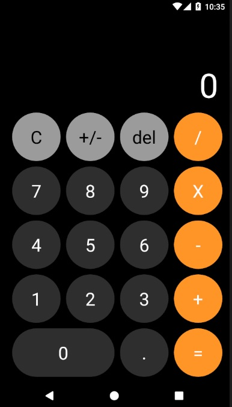

# IOS Calculator Clon

App nativa multiplataforma desarrollada con React native adaptable a cualquier tamaño de pantalla (portrait mode).

Creditos a Fernando Herrera (Profesor del curso de React Native)
twitter: @Fernando_Her85

## ¿Cómo funciona?

Requiere Node.JS 10

- `npm install` para instalar dependencias
- `npm start` para el entorno de desarrollo
- `npm run android` para iniciar app en android
- `npm run ios` para iniciar app en ios

## Lincencia

MIT
